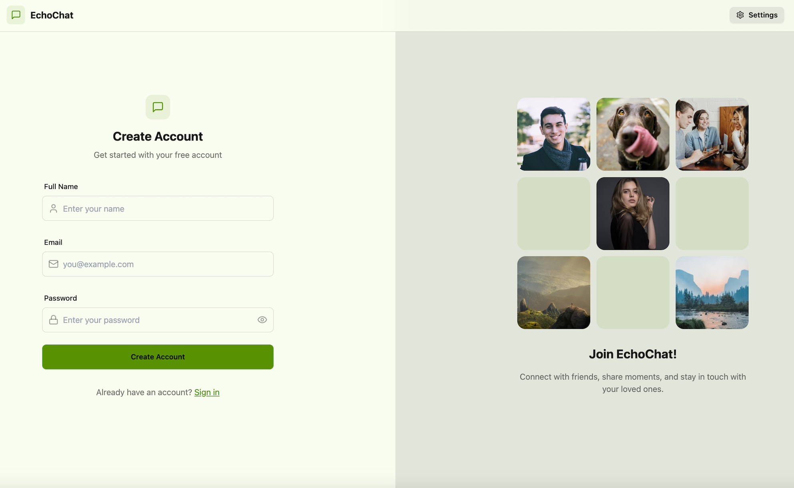
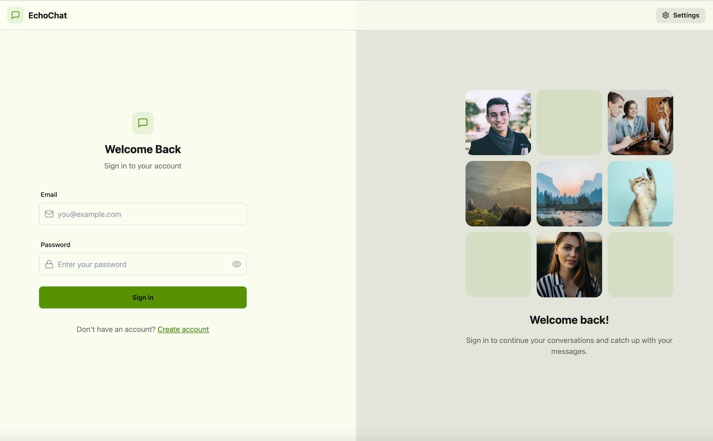
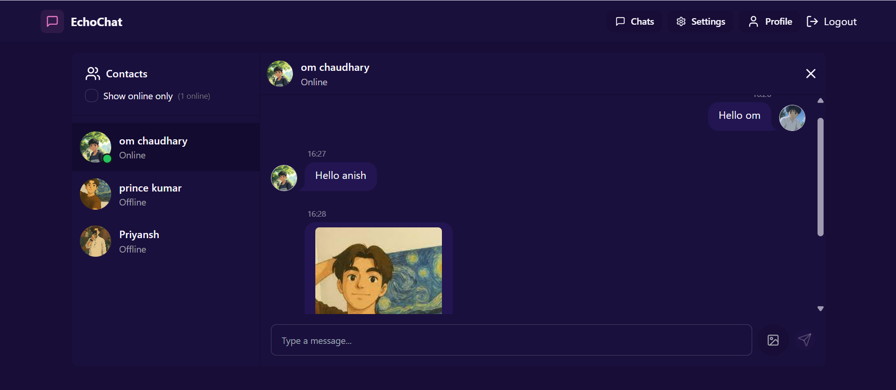
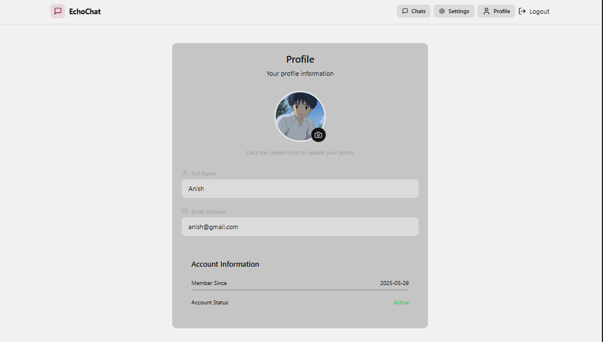
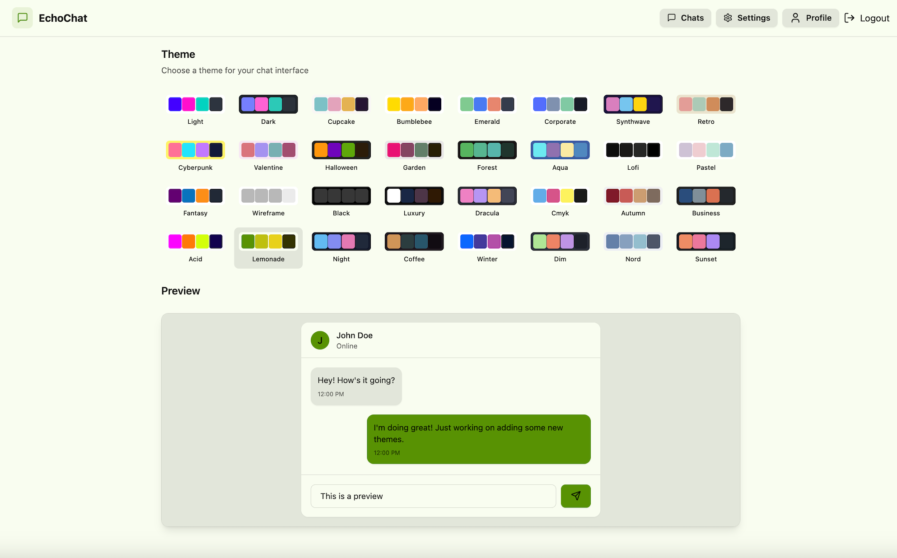

# EchoChat

**EchoChat** is a modern real-time chat app built with the **MERN** stack. It features secure messaging, live status, image sharing, user profiles, theming, and more — optimized for both desktop and mobile.

🌐 **Live App:** [https://echochat-sand.vercel.app/](https://echochat-sand.vercel.app/)

---

## 🔥 Features

- **JWT Authentication** with HTTP-only cookies
- **Real-Time Chat** via Socket.IO
- **Image Sharing** with Cloudinary
- **Live Online Status**
- **Profile Customization**
- **30+ Themes with DaisyUI**
- **Responsive UI** with TailwindCSS

---

## 📸 Screenshots

- **Signup Page**  
  

- **Login Page**  
  

- **Chat Interface**  
  

- **Profile Page**  
  

- **Settings / Theme Switcher**  
  

---

## 🛠 Tech Stack

### Frontend
- React + Vite
- TailwindCSS + DaisyUI
- Zustand, Axios
- React Router DOM
- Socket.IO Client

### Backend
- Node.js + Express
- MongoDB + Mongoose
- Socket.IO
- JWT Authentication
- Cloudinary (Image Uploads)
